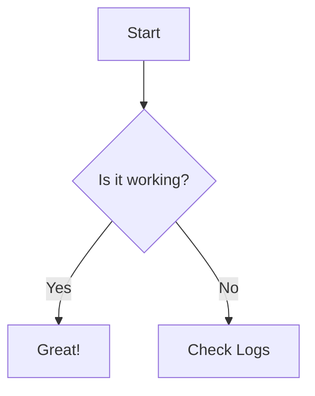
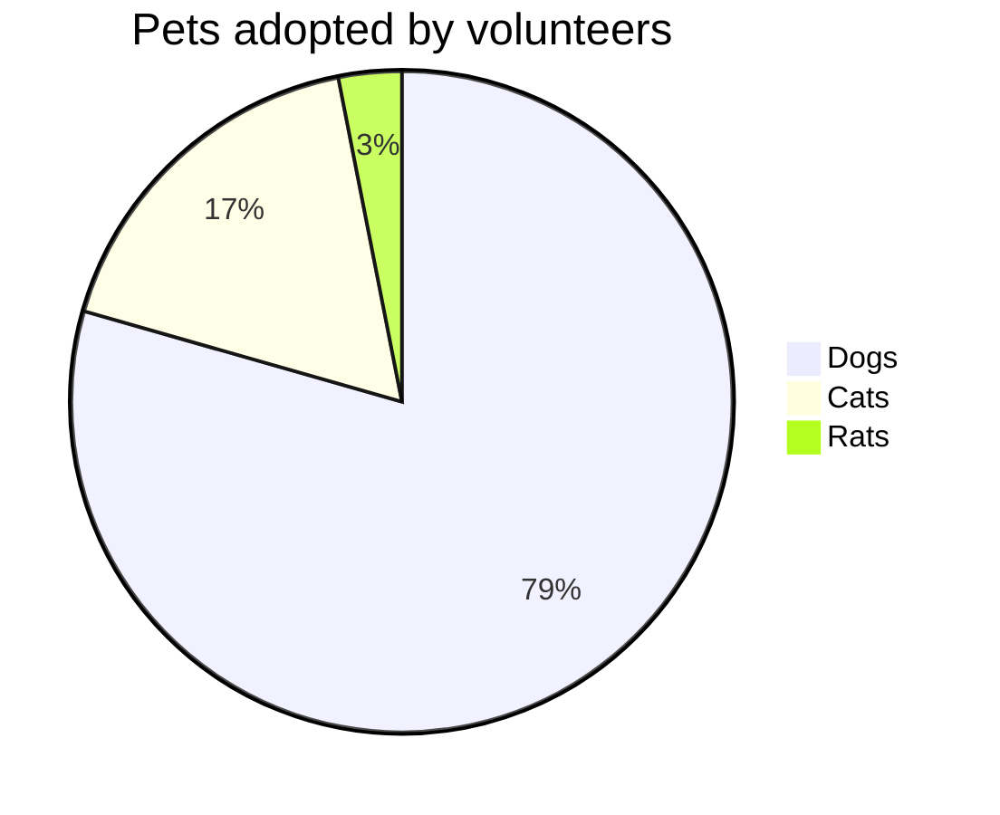

# Mermaid Diagram



---

# Monaco Editor

Try editing this code! Type safety (ATA) should kick in for the `nanostores` import.

```ts {monaco}
import { atom } from 'nanostores'

const counter = atom(0)

counter.subscribe(v => {
  console.log('Value changed:', v)
})

console.log('Current value:', counter.get())
```

---

# Mermaid in step-click

<step-click>



</step-click>

---

# Table of Contents

<s-toc />

---

# Links

- <s-link to="1">Back to Start</s-link>
- <s-link href="https://google.com">Google</s-link>

---

# Tweet

<s-tweet id="1381223403328225281" />

---

# YouTube

<s-youtube id="dQw4w9WgXcQ" />

---

# Video

<s-video src="https://www.w3schools.com/html/mov_bbb.mp4" />
