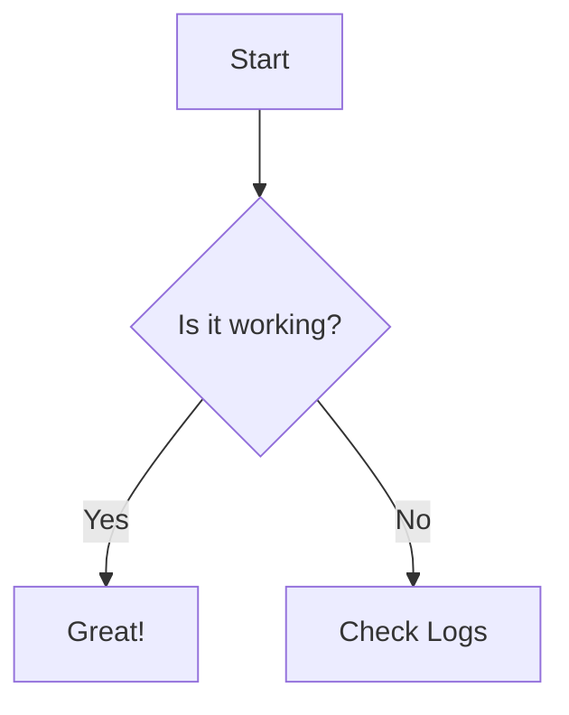
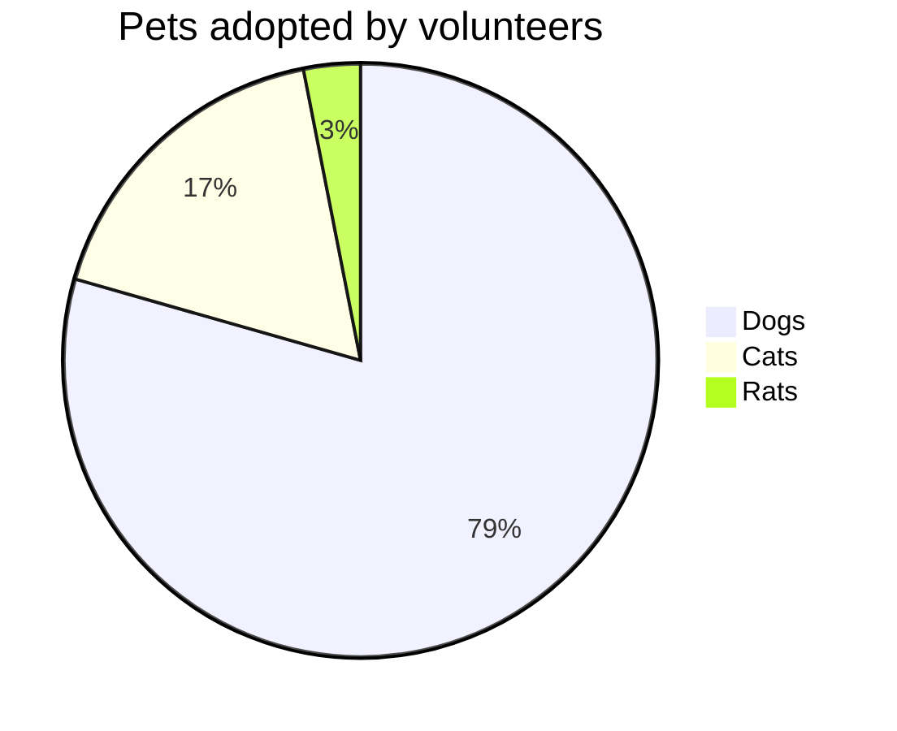

# Mermaid Diagram



---

# Monaco Editor

Try editing this code! Type safety (ATA) should kick in for the `nanostores` import.

```ts {monaco}
import { atom } from 'nanostores'

const counter = atom(0)

counter.subscribe(v => {
  console.log('Value changed:', v)
})

console.log('Current value:', counter.get())
```

---

# Mermaid in step-click

<step-click>



</step-click>
