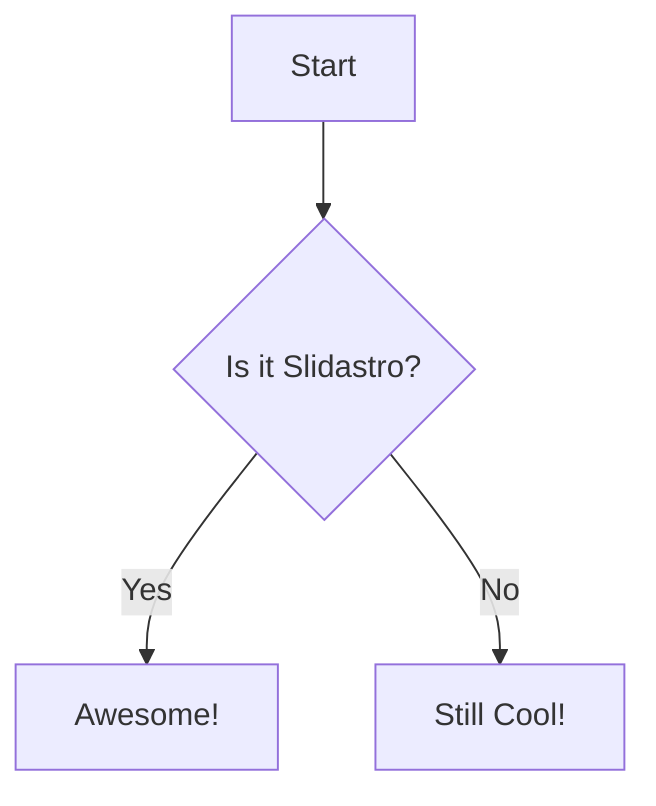

# Slidastro
Astro-powered slide presentations

<v-click>
- **Phase 1**: Foundation (Done)
</v-click>
<v-click>
- **Phase 2**: Visual Foundation (Done)
</v-click>
<v-click>
- **Phase 3**: Client SPA & Interactivity (Next)
</v-click>

---
---
layout: cover
---

# Built-in Layouts
This uses the `cover` layout.

---
---
layout: two-cols
---

# Two Columns
This uses the `two-cols` layout.

::right::

### Right Slot
Content on the right side.

---

# Math & Code

Math: $E = mc^2$

```ts
function hello() {
  console.log("Hello Slidastro!");
}
```

---

# Mermaid Diagram



---

# Monaco Editor

```ts {monaco}
import { atom } from 'nanostores'

const $counter = atom(0)
console.log($counter.get())
```
